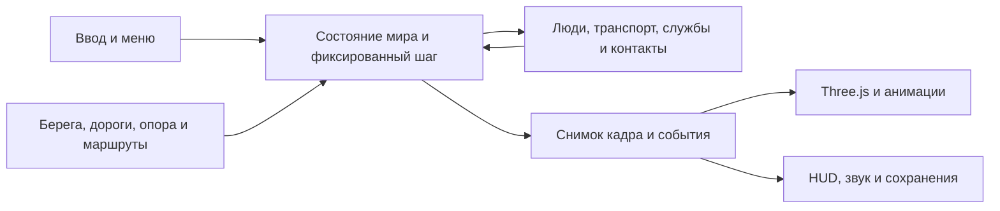

# LOWTOWN: структура движка и сравнение открытых проектов

Проверено 3 октября 2026 года. Three.js уже является основным рендерером LOWTOWN. Его замена сейчас не устранит ошибки опоры, причин столкновения и распределения обязанностей. Нужна постепенная перестройка игрового runtime вокруг одного состояния мира и явных систем обновления.

## Исходные проблемы и выполненная перестройка

До перестройки `src/main.js` занимал примерно 4 650 строк: создание архипелага, дороги, службы, пешеходы, физика игрока, интерфейс, звук, сохранения, старый Canvas-рендерер и запуск Three.js находятся вместе. `updatePhysics()` напрямую меняет DOM и вызывает звук и уведомления. Добавление двери, повреждения или нового поведения требует учитывать все эти побочные действия.

Фактически игра использует `test_drive_core.js`, `free_roam.js`, `solid_contacts.js` и функции живого города из `main.js`. В `src/game` также есть более старые контроллеры, собственные форматы состояния транспорта и несколько форматов сохранений. Теперь рабочие модули расположены в `src/simulation` и `src/world`; прежние контроллеры вынесены в `src/labs/legacy`. Наличие исследовательского файла не означает, что им управляется опубликованная машина.

Three.js показывает высоту моста, а основная наземная физика использует координаты x/y и ориентированные прямоугольники. Полный 3D-контроллер с опорным лучом, высотой, гравитацией и физическими уровнями мира ещё не внедрён. Переход к нему нужен для многоуровневых дорог, падений с высоты и подвески, но требует повторной проверки всех маршрутов служб, островов и транспорта.

Создан экспортируемый `createGameRuntime()` с передаваемым окружением и зависимостями. 21 система разделена по обязанностям; `main.js` содержит шесть строк. Тесты города импортируют этот же runtime; VM используется только для прежних сценарных выражений. Жизненный цикл владеет слушателями, кадрами и таймерами.

## Сравнение с первоисточниками

| Проект / библиотека | Что проверено | Что применимо к LOWTOWN | Ограничение |
| --- | --- | --- | --- |
| [Sketchbook](https://github.com/swift502/Sketchbook), MIT | Отдельные World, Character, Vehicle, VehicleDoor; капсула и опорный raycast; состояния персонажа; физика Cannon; отдельные шаги симуляции и рендера | Явные состояния посадки/выхода; дверь как дочерний объект со своим шарниром; отделение визуальной модели от коллайдера; общий жизненный цикл сущностей | Архивирован в 2024 году. Прямое подключение старого Cannon/Three поверх нынешней версии создаст две физические системы. Использовать подходы и адаптировать компоненты, а не целиком заменять игру |
| [Three.js-City](https://github.com/mauriciopoppe/Three.js-City), Apache-2.0 для кода | Панель параметров, сохранённые камеры, повторное использование частиц дождя, cubemap автомобиля, измерения FPS в README | Независимые настройки чёткости, эффектов и камеры; повторное использование ресурсов; отражения как отдельный уровень качества | Очень старый прототип. Его исторические FPS не сравнимы с LOWTOWN на другом устройстве. Автомобиль, текстуры и звук имеют отдельные источники: лицензия репозитория не разрешает автоматически копировать все ассеты |
| [Kenney City Kit (Roads)](https://kenney.nl/assets/city-kit-roads), CC0 | 90 ассетов; в версии 2.1 добавлены дорожные знаки и светофоры | Готовые дорожные элементы, указатели, ограждения; геометрия и вариации уличного оформления | Набор модульный и стилизованный; готовые прямые плитки не заменят нашу органическую сеть дорог |
| [Kenney Car Kit](https://kenney.nl/assets/car-kit), CC0 | 45 ассетов; версия 2.0 добавляет обломки | Обломки, вспомогательные машины, быстрые прототипы повреждений | Стиль проще предоставленных пользователем реалистичных референсов. Прямой заменой всех машин требуемое качество не получить |

Исходник [VehicleDoor.ts](https://github.com/swift502/Sketchbook/blob/master/src/ts/vehicles/VehicleDoor.ts) подтверждает отдельный шарнир, сторону двери, целевой угол и обновление по времени. [World.ts](https://github.com/swift502/Sketchbook/blob/master/src/ts/world/World.ts) показывает отдельные graphicsWorld/physicsWorld, фиксированный шаг физики, список обновляемых сущностей и проверку выхода за пределы мира. Это подтверждённые свойства кода; внешние проекты не прогонялись через нашу матрицу, поэтому их отсутствие ошибок или превосходство FPS не утверждается.

## Ошибки LOWTOWN и изменения текущей сборки

- Причина падения определялась только фактом контакта с человеком. Теперь учитываются тип второго тела и движение именно автомобиля в сторону человека. Неподвижные предметы и стоящие машины не вызывают наезд.
- Видимый пляж масштабировался на 1,8%, а физика разрешала 108 единиц за береговой линией. Теперь береговая полоса строится с той же шириной, опора проверяется под всей стопой, а пешая геометрия мостов не наследует запас для автомобиля.
- Автоматическая резкость падала до 50%; сравнение округлённого размера с округлением Three.js вниз могло пересоздавать буфер каждый кадр. Разрешение теперь сохраняется явно, изменение размеров проверяется по CSS-размеру и выбранному масштабу.
- Визуальные части машины теперь разделены на кузов, двери, колёса, дворники и эффекты повреждений. Коллайдер сохраняет свои размеры. Геометрия целой машины остаётся общей; повреждение меняет экземпляр.
- Графика персонажа и оформление улицы вынесены из общего рендера в отдельные модули. Настройки графики также имеют свой модуль и сохраняются независимо от игрового прогресса.

## Реализованная структура

```text
src/app/          bootstrap, input, audio, persistence, PWA, telemetry
src/runtime/      createGameRuntime, shared state, fixed clock, lifetime, diagnostics
src/world/        archipelago, streets, terrain support, parcels, navigation
src/simulation/   player, traffic, pedestrians, services, incidents, contacts
src/render/three/ scene, camera, characters, vehicles, materials, effects
src/render/canvas/ compatibility renderer
src/ui/           menu, HUD, map, garage, styles
src/assets/       shared geometry, source/license records
src/tools/        driving tools
src/labs/legacy/  tested research controllers
tests/matrix/     terrain × contact × timestep; renderer × DPR × settings
```



Перенесено 109 файлов, удалены 23 неиспользуемых файла по графу production, тестов и инструментов. В числе удалённых: пустой events.js, старые загрузчики управления и неиспользуемые стили. Лаборатории, нужные CI, сохранены отдельно. Пути импортов, браузерных fixtures и workflow обновлены.

Остаётся следующий этап архитектуры: системы пока обмениваются явным общим контекстом. Некоторые функции симуляции ещё вызывают UI и звук напрямую. Очередь игровых событий и единый реестр сущностей следует вводить постепенно за действующим runtime. Здоровье человека при посадке уже отделено от здоровья машины; версионирование сохранения мира сохранено.

Если потребуется настоящая 3D-физика, добавить один адаптер (например, Rapier) за контрактом контактов и опоры. Прежде чем переключать весь город, проверить капсулу персонажа, подъём на мост, транспорт под мостом, выход у пирса, тонкие ограждения и маршруты служб. Выбор физического движка делать после этой вертикальной проверки и профилирования полной сцены.

## Измерения после детализации

Сначала проверяется полный режим: подробное освещение, чёткое разрешение, дождь, отражения, анимации и повреждения. Затем отдельно фиксируются время логики, время подготовки рендера, реальная частота кадров, число вызовов отрисовки, треугольники и изменения framebuffer. Геометрический бюджет не заменяет измерение FPS. Software GPU в CI не является измерением производительности телефона.

Оптимизация допустима через локальные границы геометрии, повторное использование ресурсов, кэш статических коллайдеров и исключение невидимых объектов. Уменьшение разрешения или отключение деталей должно оставаться явной настройкой пользователя.

### Проверенные результаты

Матрица содержит 24 сценария контактов (30/60/120 Гц × 8 типов), 6 сценариев опоры, 672 сочетания модели/погоды/повреждения/стороны двери/шага и 60 сочетаний размера/масштаба framebuffer. Проверяются отсутствие ложных наездов, действительный удар движущейся машиной, сохранение опоры, восстановление некорректной позиции, независимость повреждённой геометрии и сохранение настроек.

Нативный браузерный сценарий сравнивался с опубликованным `bd16d09`: одинаковое зерно, 152 пешехода, 122 динамических тела, пять выборок по 120 фиксированных шагов с одним Canvas-кадром в конце каждой выборки. Медиана: 8,27 → 4,94 мс на шаг (около −40%). Результат относится к этому сценарию и включает небольшой вклад Canvas-кадра.

В полном режиме PBR при масштабе 1,5 программный GPU тестового окружения показал около 0,64 FPS при 1280×800 и 1,98 FPS при 390×844. CPU-подготовка рендера имела медиану 4,5 и 4,2 мс соответственно; framebuffer оставался неизменным между кадрами. Это указывает на ограничение программной растеризации. Эти цифры нельзя выдавать за FPS телефона или видеокарты. Настройки простого освещения и эффектов доступны пользователю; автоматического падения резкости больше нет.
